# India Company Crawler

This Python script crawls the Zauba Corp website to extract company listing data from pages pertaining to companies registered in India.

It uses the Cloudscraper library to perform HTTP requests with randomized user-agent headers and TLS/SSL protocols to bypass certain anti-bot protections. Proxies are also cycled randomly for each request to avoid detection.


The India crawler is divided into 2 phases:
- **Phase 1**: Scraping the URLs of each company

- **Phase 2**: Based on the URLs of each company, we proceed to scrape the information of each company
## PHASE 1:
### Logic Process

    Initialize start time and shuffled proxy list
    
    Loop from page to total_pages
    
        Set retry count and success flag
    
        Retry request with random proxy until success or max retries
    
            Scrape data on success and write to file
    
            Sleep, handle errors, increment retry count on failure
    
        Print progress
    
        Increment page number
    
    Print finished message

### Logic Diagram


### Usage
```commandline
pip install requirements_india.txt
```
Copy new crawler, rename it depend on RoC-City.

Update the configuration variables at the top of crawler_india_{city}_companies.py file:

file_path: Path to save scraped data

max_retries_per_page: Maximum retries per page

sleep_duration_on_success: Sleep duration after successful scrape

total_pages: Total number of pages to scrape

page_start: Starting page number

url: Base URL template string


### Run the scraper:

Example:
```commandline
python3 crawler_india_mumbai_companies.py
```
The output will be scraped company links/data saved to the specified file path. It will cycle through randomly selected proxy servers on each request to avoid detection.

Progress is printed periodically to stdout including elapsed/estimated remaining time.

## PHASE 2:
### Logic Process

    Read urls list    

    Initialize start time and shuffled proxy list
    
    Loop from url to urls
    
        Set retry count and success flag
    
        Retry request with random proxy until success or max retries
    
            Scrape data on success 
    
            Sleep, handle errors, increment retry count on failure
    
        Print progress
    
        Increment page number
    
    Write data to output file

    Print finished message

### Logic Diagram



### Run the scraper:

Example:
```commandline
python3 get_infor_mumbai_companies.py
```
The output will be scraped information data company links/data saved to the specified file path. It will cycle through randomly selected proxy servers on each request to avoid detection.

Progress is printed periodically to stdout including elapsed/estimated remaining time.

### Notes:

Increase sleep_duration_on_success for less aggressive scraping to avoid getting blocked

Reduce max_retries_per_page if failing too often to avoid excessive retries

Increase concurrency by launching multiple scraper instances with different page_start/end chunks


### Alert
Let me know if any other part of the documentation needs explanation or improvement!

### Contact
- Long Phan *(ICTTM)*

**Email:** long@icttm.net

- Xuan Phuoc *(ICTTM)*

 **Email**: phuoc@icttm.net